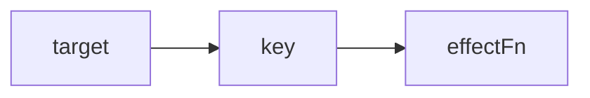
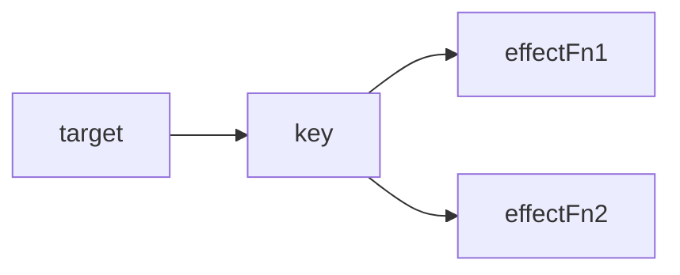
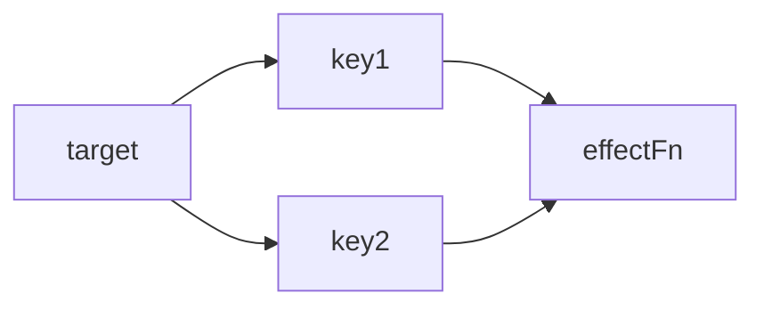
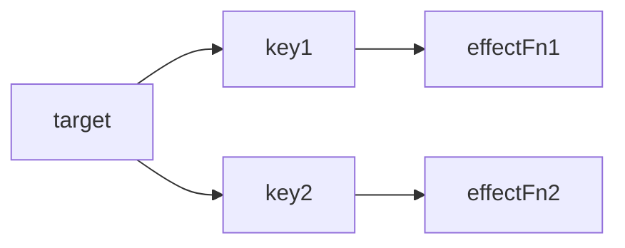
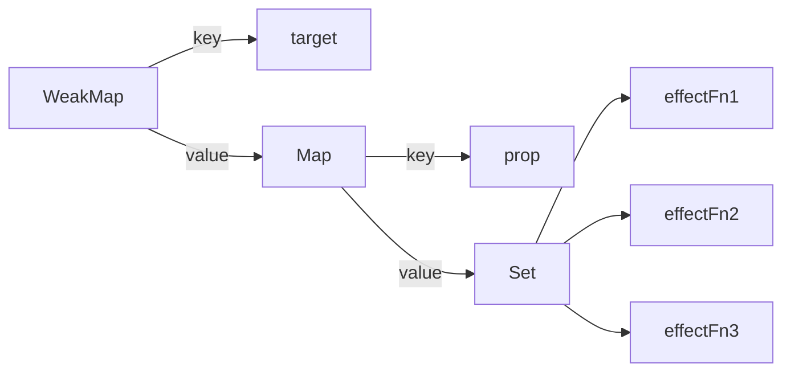
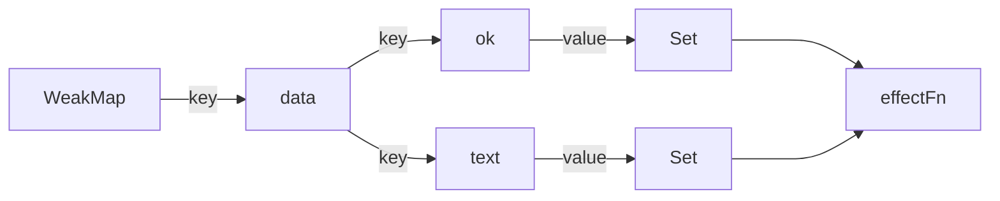
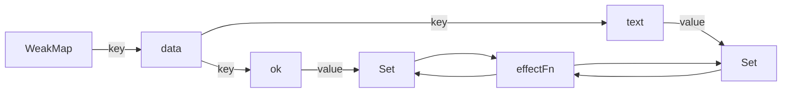

# 响应系统(4~6章)

## 4.1 响应式数据与副作用函数

副作用函数指的是会产生副作用的函数（如：修改输入参数、修改全局变量、IO 操作及状态改变），具体代码如下：

```javascript
// 除 effect 以外，任意函数都可能读取或修改 body 的内容，所以执行 effect 就直接或间接的影响了其他函数的执行，这样的函数被称为副作用函数
function effect() {
  document.body.innerText = 'Hello World';
}
```

假设在副作用函数中读取了某一个对象的属性，当这个对象的属性再次变化时，我们希望副作用函数可以重新执行，如果能实现这个目标，那么这个对象就是响应式数据：

```javascript
const obj = { text: 'Hello World' }
function effect () {
	document.body.innerText = obj.text;
}
```

## 4.2 响应式数据的基本实现

将 obj 变成响应式数据有一个必须满足的要求，就是监听属性的读取和设置操作：

* 副作用函数执行：触发 obj.text 的读取操作；
* 修改 text 属性值：触发 obj.text 的设置操作；

当 obj.text 触发读取操作时将 effect 存储到”桶“（依赖收集），当 obj.text 触发设置操作时，将 effect 从”桶“中取出执行即可。

要实现对象属性读取和设置的拦截，在 ES2015 之前只能通过 Object.defineProperty 函数实现，在 ES2015+中可以使用 Proxy 代理对象实现，分别代表了 Vue.js2 和 Vue.js3 的实现方案：

```javascript
// mini-vue3.js
const bucket = new Set();

function reactive(data, fn) {
    return new Proxy(data, {
        get(target, key) {
            bucket.add(effect);
            return target[key];
        },
        set(target, key, value) {
            target[key] = value;
            bucket.forEach(fn => fn());
            return true;
        }
    })
}
```

调用编写好的 reactive 函数，将 data 变成响应式数据 obj：

```javascript
const data = { text: 'Hello World!' }

// 将 data 变成响应式对象
const obj = reactive(data)

function effect() {
    document.body.innerHTML = obj.text;
}

effect();

setTimeout(() => {
    obj.text = 'Hello Vuejs3';
},1000)
```

由于目前 effect 是硬编码到 reactive 函数中，这样当副作用函数名称修改后，框架将无法正常工作，使得当前的实现非常不灵活。

## 4.3 设计一个完善的响应系统

为了移出硬编码副作用函数的方式，这里引入了注册副作用函数的机制，通过全局变量 `__activeEffect` 来存储副作用函数，在框架中编写 effect 函数，此函数用于注册应用中使用到的副作用函数：

```javascript
// mini-vue3.js
const bucket = new Set();

// 储存副作用函数
window.__activeEffect = undefined;

// 注册副作用函数的函数
function effect(fn) {
    window.__activeEffect = fn;
    fn();
}

function reactive(data) {
    return new Proxy(data, {
        get(target, key) {
            if(window.__activeEffect) {
                bucket.add(window.__activeEffect);
            }
            return target[key];
        },
        set(target, key, value) {
            target[key] = value;
            bucket.forEach(fn => fn());
            return true;
        }
    })
}
```

在应用中使用时，为 effect 传入一个设置 body 内容的匿名函数，并首次执行，在 1 秒钟后由于修改 obj.text 的内容而触发 set 拦截再次执行：

```javascript
const data = { text: 'Hello World!' }

// 将 data 变成响应式对象
const obj = reactive(data)

effect(() => {
    document.body.innerHTML = obj.text;
});

setTimeout(() => {
    obj.text = 'Hello Vuejs3';
},1000)
```

在匿名的副作用函数中目前仅读取了 `obj.text`，但如果在 setTimeout 中尝试为 obj 添加一个新的属性并赋值，将会看到 effect 函数并执行了两次：

```javascript
const data = { text: 'Hello World!' }

// 将 data 变成响应式对象
const obj = reactive(data)

effect(() => {
    console.log('effect')
    document.body.innerHTML = obj.text;
});

setTimeout(() => {
    obj.nokey = 'Hello Vuejs3';
},1000)
```

这是因为目前仅用 Set 结构来存储的副作用函数，而副作用函数并没有和具体的目标字段建立连接，所以造成了这个现象，所以接下来主要就是建立原始对象（target）、字段名（key）和副作用函数（effectFn）,下图是几种可见的对应关系：










了解的所有可见的对应关系，现在定义一个 WeakMap 结构来存储对应关系，如下图：



按照图示结修改 Proxy 内部代码，利用新的 bucket 完善对应关系：

```javascript
// mini-vue3.js
const bucket = new WeakMap();

window.__activeEffect = undefined;

function effect(fn) {
    window.__activeEffect = fn;
    fn();
}

// 将 fn 添加到 target 中 key 下的的副作用函数集合
function track(target, key) {
    if (!window.__activeEffect) return;

    let map = bucket.get(target);
    if (!map) {
        map = new Map();
        bucket.set(target, map);
    }

    let effects = map.get(key);
    if (!effects) {
        effects = new Set();
        map.set(key, effects);
    }

    effects.add(window.__activeEffect);
}

// 调用 target 中指定 key 下的所有副作用函数
function trigger(target, key) {
    const map = bucket.get(target);
    if (!map) return;
    const effects = map.get(key);
    effects?.forEach(effect => effect());
}

function reactive(data) {
    return new Proxy(data, {
        get(target, key) {
            track(target, key);
            return target[key];
        },
        set(target, key, value) {
            target[key] = value;
            trigger(target, key);
        }
    })
}
```

这里解释一下使用 WeakMap 的原因，WeakMap 的特点是它的 Key 在底层规范为弱引用，相比于 Map 中 Key 为强应用来说，更利于垃圾回收机制进行回收，正如下面这段代码所示，当 10，11 行执行完毕后，由于 fn1 任作为 Key 被 Map 引用，所以无法回收，而 fn2 虽然作为 weak 的 key，但由于弱引用的设计，并不影响垃圾回收，那么如果使用 Map 做桶的结构，那么就有可能因为应用中已经不需要引用 target 了，但 target 不会被回收，造成内存泄漏：

```javascript
const map = new Map();
const weak = new WeakMap();

const fn1 = { text: 'Hello Fn1' };
const fn2 = { text: 'Hello Fn2' };

map.set(fn1, fn1)
weak.set(fn2, fn2)

console.log("map has fn1: ", map.has(fn1)) // true
console.log("weak has fn2: ", weak.has(fn2)) // true

console.log("map: ", map); // Map(1) { { text: 'Hello Fn1' } => { text: 'Hello Fn1' } }
console.log("weak: ", weak); // WeakMap { <items unknown> }
```

## 4.4 分支切换与cleanup

在下图的副作用函数中当 obj.ok 的值发生变化时，代码执行的分支将发生变化，这就是分支切换。

```                                                                                                                                                    JavaScript
const data = { ok: true, text: 'Hello World!' }

// 将 data 变成响应式对象
const obj = reactive(data)

effect(() => {
    document.body.innerHTML = obj.ok ? obj.text : 'not';
});
```

由于 obj.ok 初始值为 true，所以当副作用函数执行时，会触发 ok 和 text 两个属性的读取操作，此时所建立的连接如下图：



分支切换可能会产生遗留的副作用函数，正如下面的代码所示：当 1 秒过后将 obj.ok 切换为 false，再过 1 秒将 obj.text 更新为 'Hello Vuejs3'，页面并不会发生变化（obj.text 不会读取），但副作用函数仍被执行，因为产生了遗留的副作用函数。

```javascript
const data = { ok: true, text: 'Hello World!' }

// 将 data 变成响应式对象
const obj = reactive(data)

effect(() => {
    console.log('effect')
    document.body.innerHTML = obj.ok ? obj.text : 'not';
});

setTimeout(() => {
    obj.ok = false;
}, 1000)

setTimeout(() => {
    obj.text = 'Hello Vuejs3';
}, 1000)
```

解决遗留副作用函数思路就是在执行副作用函数的之前删除依赖关系，在执行副作用函数之后重新建立依赖关系。要将副作用函数从所有已知的依赖集合中移除，就需要明确哪些依赖集合中包含了它，因此需要重新设计副作用函数：

```javascript
function effect(fn) {
    const effectFn = () => {
        window.__activeEffect = effectFn;
        fn();
    }
    effectFn.deps = []; // 存储与此副作用函数相关联的依赖集合
    effectFn();
}
```

```javascript
function track(target, key) {
    if (!window.__activeEffect) return;

    let map = bucket.get(target);
    if (!map) {
        map = new Map();
        bucket.set(target, map);
    }

    let effects = map.get(key);
    if (!effects) {
        effects = new Set();
        map.set(key, effects);
    }

    effects.add(window.__activeEffect);
  	// 完成依赖反向收集
    window.__activeEffect.deps.push(effects);
}
```




接着增加清空依赖集合的方法，并在 effectFn 中优先执行清空依赖集合：

```javascript
function cleanup(effectFn) {
    effectFn.deps.forEach(effect => {
        effect.delete(effectFn);
    });
    effectFn.deps.lenght = 0;
}

function effect(fn) {
    const effectFn = () => {
        cleanup(effectFn); // 清空依赖集合
        window.__activeEffect = effectFn;
        fn();
    }
    effectFn.deps = []; // 存储与此副作用函数相关联的依赖集合
    effectFn();
}

function trigger(target, key) {
    const map = bucket.get(target);
    if (!map) return;
    const effects = map.get(key);
    const effectsToRun = new Set(effects);
    effectsToRun.forEach(effect => effect()); // 解决由于删除 Set 集合的元素造成 forEach 进入死循环
    // effects?.forEach(effect => effect());
}
```

PS：当使用 forEach 遍历 Set 集合，由于被访问过的值被删除后重新添加到集合，如果 forEach 没有结束，那么这个值将会被再次访问，造成死循环；

## 4.5 嵌套的 effect 与 effect 栈

副作用函数在实践中时允许被嵌套使用的，例如一个组件中包含了另一个组件，这样就形成了一个嵌套，现在将 4.4 最后的案例进行修改，来演示一下现在就嵌套 effect 会有什么问题。

```javascript
const data = reactive({ text1: 'Hello text1!', text2: 'Hello text2!' });

effect(function fn1() {
    console.log('effect text1');
    effect(function fn2() {
        console.log('effect text2');
        data.text2;
    });
    data.text1;
});

setTimeout(() => {
    data.text1 = 'text1';
}, 1000);
```

在上述代码中，我们在读取 `data.text1`时期望  fn1 执行时打印 `effect text1`，又因为内部嵌套着 fn2, 所以 fn2 也会执行并打印 `effect text2`，当只读取 `data.text2`则仅打印 `effect text2`。

但你运行代码后会发现结果和预期并不相同，反而是在 1 秒过后打印了 `effect text2`，那说明是 fn2 被再次执行，现在这个现象就是由于嵌套导致的执行不一致的情况。

造成这个情况出现的主要原因是由于我们全局设置 `window.__activeEffect` 仅能存储一个副作用函数，由于嵌套发生造成了内层的 fn2 覆盖了 fn1，要解决这个问题需要引入栈结构，当副作用函数执行时，将副作用函数先压入栈中，等副作用函数执行完成后将它出栈，并使用让 `window.__activeEffect`指向栈顶的副作用函数，完成副作用函数顺序的管理调度，从而避免被覆盖的清空发生。

```javascript
// mini-vue3.js
const effectStack = []; // 用来管理副作用函数执行顺序

window.__activeEffect = undefined;

function effect(fn) {
    const effectFn = () => {
        cleanup(effectFn);
        effectStack.push(effectFn); // 执行前入栈
        window.__activeEffect = effectFn;
        fn();
        effectStack.pop(); // 执行后出栈
        window.__activeEffect = effectStack[effectStack.length - 1]; // 将 __activeEffect 指向上一个副作用函数
    }
    effectFn.deps = []; // 存储与此副作用函数相关联的依赖集合
    effectFn();
}
```

## 4.6 避免无限递归循环

为了做一个完善的响应系统就考虑诸多的细节，目前还有一个无限递归循环的问题非常棘手，请看下方的代码片段：

```javascript
const data = reactive({ ok: true });

effect(() => {
    console.log('effect');
    data.ok = !data.ok
});
```

在副作用函数中将 `data.ok` 取反后再次赋值给了 `data.ok`，这在我们的响应系统中会分别触发 `track` 和 `trigger`，由于副作用函数本身就在执行，由因为内部的读取\设置操作再次引发副作用函数的执行，从而形成了无限递归的现象，造成栈溢出。

由于读取或设置操作在同一个副作用函数中发生，所以 `track`收集的副作用函数和 `trigger`正在执行的副作用函数其实是同一个，那么可以通过在 `trigger` 中增加判断来拦截这种现象，如果刚触发 `trigger`的副作用函数与当前正在执行的副作用函数相同，则不触发执行：

```javascript
function trigger(target, key) {
    const map = bucket.get(target);
    if (!map) return;
    const effects = map.get(key);
    const effectsToRun = new Set(effects);
    effectsToRun.forEach(effect => {
        if(effect !== window.__activeEffect) {
            effect();
        }
    });
}
```

## 4.7 调度执行

可调度性是响应系统非常重要的特性。所谓可调度性指的是当 `trigger` 触发副作用函数重新执行时，有能力决定副作用函数执行的时机、次数以及方式。

首先来看一下，如何决定副作用函数的执行方式，以下面的代码为例：

```javascript
const data = reactive({ counter: 1 });

effect(() => {
    console.log('effect', data.counter);
});

data.counter++;

console.log('over~');
```

在副作用函数中会首先打印一次 counter 的值，接着执行后 counter++ 时会再次打印，最后打印 over~，如果要在不调整代码的情况下实现 counter++ 触发副作用函数打印的执行和最后 over~的打印顺序调整？这时就需要响应系统支持调度：

实现执行方式的调度，需要对框架中的 effect 函数扩展一个 options 选项，在 options 选项上挂载一个 scheduler 调度器函数，最后在 trigger 函数触发时将函数执行的控制权交给应用端。

```javascript
function effect(fn, options = {}) {
    const effectFn = () => {
        cleanup(effectFn);
        effectStack.push(effectFn);
        window.__activeEffect = effectFn;
        fn();
        effectStack.pop();
        window.__activeEffect = effectStack[effectStack.length - 1];
    }
    effectFn.options = options; // 存储选项
    effectFn.deps = []; // 存储与此副作用函数相关联的依赖集合
    effectFn();
}
```

```javascript
function trigger(target, key) {
    const map = bucket.get(target);
    if (!map) return;
    const effects = map.get(key);
    const effectsToRun = new Set(effects);
    effectsToRun.forEach(effect => {
        if (effect !== window.__activeEffect) {
            // 携带调度器函数的要交由应用端执行
            if (effect.options.scheduler) {
                effect.options.scheduler(effect);
            } else {
                effect();
            }
        }
    });
}
```

```javascript
const data = reactive({ counter: 1 });

effect(() => {
    console.log('effect', data.counter);
}, {
    scheduler(fn) {
        // 渲染主线程执行完毕后，执行延迟队列任务
        setTimeout(fn);
    }
});

data.counter++;

console.log('over~');
```

接着调整一下应用端的代码，一起来看一下可调度执行次数是怎么回事：

```javascript
const data = reactive({ counter: 1 });

effect(() => {
    console.log('effect', data.counter);
});

data.counter++;
data.counter++;
data.counter++;
data.counter++;
```

通过这段代码可以知道就是，counter 从初始的 1 进过自增 4 次后最终的结果是 5，这时一个不争的事实，所以中间 3 次的自增对我们来说就没有那么重要，我们只关心 counter 的初始值和最终值。

`counter` 连续 4 次自增会触发4 次 `scheduler` 函数执行，相同的副作用函数使用 Set 结构去重，仅保留一份，由于 `isFlushing` 条件控制，`window.__flushJob` 函数在一个事件循环内仅执行一次，即在微队列内执行一次。当微队列执行时仅有一个副作用函数，所以只会执行一次，且 counter 已经自增完成，所以只会输出初始值和最终值。

```javascript
const data = reactive({ counter: 1 });

effect(() => {
    console.log('effect', data.counter);
}, {
    scheduler(fn) {
      	// 整体会进行 4 次调度，想通的副作用函数通过 Set 结构过滤
        // 每次调度时将副作用函数添加到 job 队列
        window.__jobQueue.add(fn);
        // 调用 __flushJob 刷新队列
        window.__flushJob();
    }
});

data.counter++;
data.counter++;
data.counter++;
data.counter++;
```

```javascript
window.__jobQueue = new Set();
const p = Promise.resolve();

let isFlushing = false; // 是否正则刷新队列

window.__flushJob = () => {
    if (isFlushing) return;
    isFlushing = true; // 正在刷新队列，不执行副作用函数等
    p.then(() => {
      	// 在微队列中执行副作用函数
        window.__jobQueue.forEach(job => job());
    }).finally(() => {
      	// 结束后恢复标识
        isFlushing = false;
    });
}
```

只关注最终的状态从而忽略中间的变化，这就是 Vue 中连续多次修改响应式数据只会触发一次更新的原理实现。Vuejs 内部的调度器实现将更加完善。

## 4.8 计算属性 computed 与 lazy

## 4.9 watch 的实现原理

## 4.10 立即执行的watch与回调执行时机

## 4.11 过期的副作用

## 4.12 总结

## 5.1 理解 Proxy 和 Reflect

## 5.2 JavaScript 对象及 Proxy 的工作原理

## 5.3 如何代理 Object

## 5.4 合理地触发响应

## 5.5 浅响应与深响应

## 5.6 只读与浅只读

## 5.7 代理数组

## 5.8 代理 Set 和 Map

## 5.9 总结

## 6.1 引入 ref 的概念

## 6.2 响应式丢失的问题

## 6.3 自动脱 ref

## 6.4 总结


