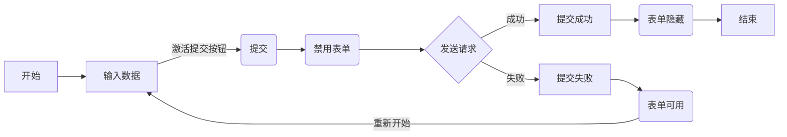

# 状态管理


## 用 State 响应输入

React 提供以声明式的方式来操作 UI。开发者无需直接操作 UI 的各个部分，而是描述组件可处于的不同状态，并根据用户输入在他们之间进行切换。

### 命令式与声明式

命令式和声明式是两种常见的编程范式，命令式编程更注重的是过程，开发者必须很明确的对过程中的每一步发出明确的命令。但声明式更注重的是结果，开发者只需要按框架提供的规则按部就班的声明和改变状态，剩下的就是等待框架反馈最终的结果。其中典型的命令式范式框架是 JQuery，声明式范式框架是 React、Vue.js等。

下图是用户提交表单的流程图，分别采用命令式和声明式两种编程范式来感受一下：



#### 示例：命令式

::: code-group

```html
<body>
  <form id="form">
    <h2>City quiz</h2>
    <p>What city is located on two cantinents?</p>
    <textarea id="textarea"></textarea>
    <br />
    <button id="button" disabled>Submit</button>
    <p id="loading" style="display: none">Loading ...</p>
    <p id="error" style="display: none"></p>
  </form>
  <h1 id="success" style="display: none">That's right~</h1>
</body>
```

```javascript [handleFormSubmit]
async function handleFormSubmit(e) {
  e.preventDefault();
  disable(textarea);
  disable(button);
  show(loadingMessage);
  hide(errorMessage);
  try {
    await submitForm(textarea.value);
    show(successMessage);
    hide(form);
  } catch (err) {
    show(errorMessage);
    errorMessage.textContent = err.message;
  } finally {
    hide(loadingMessage);
    enable(textarea);
    enable(button);
  }
}
```

```javascript [handleTextareaChange]
function handleTextareaChange() {
  if (textarea.value.length === 0) {
    disable(button);
  } else {
    enable(button);
  }
}
```

```javascript [common funcation]
function hide(el) {
  el.style.display = 'none';
}

function show(el) {
  el.style.display = '';
}

function enable(el) {
  el.disabled = false;
}

function disable(el) {
  el.disabled = true;
}
```

```javascript [submitForm]
function submitForm(answer) {
  return new Promise((resolve, reject) => {
    setTimeout(() => {
      if (answer.toLowerCase() === 'istanbul') {
        resolve();
      } else {
        reject(new Error('Good guess but a weong answer. Try agein!'));
      }
    }, 1500);
  });
}
```

```javascript [init element]
let form = document.getElementById('form');
let textarea = document.getElementById('textarea');
let button = document.getElementById('button');
let loadingMessage = document.getElementById('loading');
let errorMessage = document.getElementById('error');
let successMessage = document.getElementById('success');
form.onsubmit = handleFormSubmit;
textarea.oninput = handleTextareaChange;
```

::: 

#### 示例：声明式

在 React 中使用声明式的方式可以按下面的流程来思考：

1. 定位组件中不同的视图状态；

2. 确定触发 state 改变的输入条件；

3. 表示内存中所有的 state（使用 `useState`）； 

4. 删除不必要的 state 变量；

5. 连接事件处理函数已更新 state；

   

1. **定位组件中视图的状态**：在提交表单的案例中，视图存在以下几个状态：初始状态（`empty`）、提交中（`submitting`）、提交成功（`success`）、提交失败（`error`）。根据状态的不同 React 框架会自动控制视图的显示和 DOM 的状态：

   ```jsx
   export default function Form({ status = 'empty' }) {
     if (status === 'success') {
       return <h1>That's right~</h1>;
     }
     return (
       <>
         <h2>City quiz</h2>
         <p>What city is located on two cantinents?</p>
         <form id="form">
           <textarea disabled={status === 'submitting'}></textarea>
           <br />
           <button disabled={status === 'empty' || status === 'submitting'}>
             Submit
           </button>
           {status === 'error' && <p>Good guess but a weong answer. Try agein!</p>}
         </form>
       </>
     );
   }
   ```

2. **确定改变视图状态的触发条件**：人为触发和计算机触发时改变 state 的两种输入方式，在提交表单的案例中：

   * 改变输入框文本：根据文本框内容是否为空，将表单从空值状态切换到输入中或切回原状态；
   * 点击提交按钮：表单将状态切换为提交中；
   * 网络请求成功：表单将状态切换到提交成功；
   * 网络请求失败：表单将状态切换到提价失败；

   ```mermaid
   graph LR
   EMPTY(Empty) -- Start typing --> TYPING[Typing]
   	TYPING -- Press submit --> SUBMITTING[Submitting]
   		SUBMITTING --> Network{Network Status}
   		Network --> |Error| ERROR[Error]
   		Network --> |Success| SUCCESS[Success]
   ```

3. **通过 `useState` 表示视图状态**：

   1. 必须存在的 State：在提交表单的案例中，必须存在的 State 是文本框输入的内容和提交失败状态；

      ```jsx
      const [answer, setAnswer] = useState('');
      const [error, setError] = useState(null);
      ```

   2. 接着是视图显示的状态，以下列出的是表单提交案例中所有视图和 DOM 状态：

      ```jsx
      const [isEmpty, setIsEmpty] = useState(true);
      const [isTyping, setIsTyping] = useState(false);
      const [isSubmitting, setIsSubmitting] = useState(false);
      const [isSuccess, setIsSuccess] = useState(false);
      const [isError, setIsError] = useState(false);
      ```

4. **精简必须要的 state**：为防止出现的 state 不代表任何视图显示状态，需要将一些 state 合并或移除，降低程序的复杂度。

   * **是否存在无效状态**：例如，`isTyping` 和 `isSubmitting` 两个状态从业务角度来说不可能同时为 `true`。两个布尔值有四种可能的组合，但只有三种对应的有效状态。为了保证 state 存储的均为有效状态，可以考虑将 `typing` 、`submitting` 和 `success`合并到一个 `status`。
   
   * **是否可被替代**：
     * 例如，`isEmpty` 和  `isTyping` 不能同时为 `true`，声明为两个 `state` 有可能造成同步不一致的 BUG，同时 `answer.length` 可以完美替换掉 `isEmpty` 和 `isTyping`。
     * 例如，`isError` 也是多余的 `state`，因为 `error != null` 与`isError` 表达了相同的状态。
   
   ```jsx
   const [answer, setAnswer] = useState('');
   const [error, setError] = useState(null);
   const [status, setStatus] = useState('typing'); // typing submitting success
   ```

5. **定义事件处理函数以更新 state**：

   ```
   ```

   
